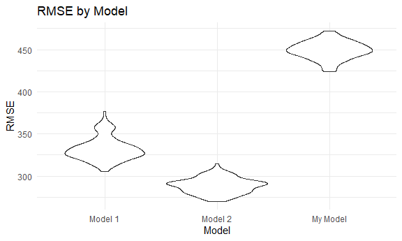

p8105_hw6_jdv2118
================
Justin Vargas

# Loading Libraries and Setting Graphic Settings

``` r
library(tidyverse)

library(viridis)

library(modelr)

knitr::opts_chunk$set(
  fig.width = 6,
  fig.asp = .6,
  out.width = "90%"
)

theme_set(theme_minimal() + theme(legend.position = "bottom"))

options(
  ggplot2.continuous.colour = "viridis",
  ggplot2.continuous.fill = "viridis"
)

scale_colour_discrete = scale_color_viridis_d

scale_fill_discrete = scale_fill_viridis_d
```

# Problem 1

To obtain a distribution for $\hat{r}^2$, we’ll follow basically the
same procedure we used for regression coefficients: draw bootstrap
samples; the a model to each; extract the value I’m concerned with; and
summarize. Here, we’ll use `modelr::bootstrap` to draw the samples and
`broom::glance` to produce `r.squared` values.

``` r
weather_df = 
  rnoaa::meteo_pull_monitors(
    c("USW00094728"),
    var = c("PRCP", "TMIN", "TMAX"), 
    date_min = "2017-01-01",
    date_max = "2017-12-31") %>%
  mutate(
    name = recode(id, USW00094728 = "CentralPark_NY"),
    tmin = tmin / 10,
    tmax = tmax / 10) %>%
  select(name, id, everything())
```

    ## Registered S3 method overwritten by 'hoardr':
    ##   method           from
    ##   print.cache_info httr

    ## using cached file: C:\Users\Justin\AppData\Local/Cache/R/noaa_ghcnd/USW00094728.dly

    ## date created (size, mb): 2022-09-18 13:28:32 (8.418)

    ## file min/max dates: 1869-01-01 / 2022-09-30

``` r
weather_df %>% 
  modelr::bootstrap(n = 1000) %>% 
  mutate(
    models = map(strap, ~lm(tmax ~ tmin, data = .x) ),
    results = map(models, broom::glance)) %>% 
  select(-strap, -models) %>% 
  unnest(results) %>% 
  ggplot(aes(x = r.squared)) + geom_density()
```


In this example, the $\hat{r}^2$ value is high, and the upper bound at 1
may be a cause for the generally skewed shape of the distribution. If we
wanted to construct a confidence interval for $R^2$, we could take the
2.5% and 97.5% quantiles of the estimates across bootstrap samples.
However, because the shape isn’t symmetric, using the mean +/- 1.96
times the standard error probably wouldn’t work well.

We can produce a distribution for $\log(\beta_0 * \beta1)$ using a
similar approach, with a bit more wrangling before we make our plot.

``` r
weather_df %>% 
  modelr::bootstrap(n = 1000) %>% 
  mutate(
    models = map(strap, ~lm(tmax ~ tmin, data = .x) ),
    results = map(models, broom::tidy)) %>% 
  select(-strap, -models) %>% 
  unnest(results) %>% 
  select(id = `.id`, term, estimate) %>% 
  pivot_wider(
    names_from = term, 
    values_from = estimate) %>% 
  rename(beta0 = `(Intercept)`, beta1 = tmin) %>% 
  mutate(log_b0b1 = log(beta0 * beta1)) %>% 
  ggplot(aes(x = log_b0b1)) + geom_density()
```


As with $r^2$, this distribution is somewhat skewed and has some
outliers.

The point of this is not to say you should always use the bootstrap –
it’s possible to establish “large sample” distributions for strange
parameters / values / summaries in a lot of cases, and those are great
to have. But it is helpful to know that there’s a way to do inference
even in tough cases.

# Problem 2

## Cleaning and Wrangling Data

``` r
homicide_data = 
  read_csv("data/homicide-data.csv") %>% 
  mutate(
    city_state = str_c(city, state, sep = ", "),
    result = case_when(
      disposition == "Closed without arrest" ~ 0,
      disposition == "Closed by arrest"      ~ 1,
      disposition == "Open/No arrest"        ~ 0
      ),
    victim_age = as.numeric(victim_age)
  ) %>% 
  filter(city_state != "Dallas, TX",
         city_state != "Phoenix, AZ",
         city_state != "Kansas City, MO",
         city_state != "Tulsa, AL",
victim_race %in% c("White", "Black"),
victim_sex != "Unknown") %>% 
  select(city_state, result, victim_age, victim_race, victim_sex)

head(homicide_data)
```

    ## # A tibble: 6 × 5
    ##   city_state      result victim_age victim_race victim_sex
    ##   <chr>            <dbl>      <dbl> <chr>       <chr>     
    ## 1 Albuquerque, NM      0         15 White       Female    
    ## 2 Albuquerque, NM      0         72 White       Female    
    ## 3 Albuquerque, NM      0         91 White       Female    
    ## 4 Albuquerque, NM      0         56 White       Male      
    ## 5 Albuquerque, NM      0         NA White       Male      
    ## 6 Albuquerque, NM      1         43 White       Female

The code above is used to clean and wrangle the data.

## Fitting Logistic Regression For Baltimore, MD

``` r
baltimore_glm =
  homicide_data %>% 
  filter(city_state == "Baltimore, MD")

glm(result ~ victim_age + victim_sex + victim_race, 
    data = baltimore_glm,
    family = binomial()) %>% 
  broom::tidy() %>% 
  mutate(
    or = exp(estimate),
    ci_lower = exp(estimate - 1.96 * std.error),
    ci_upper = exp(estimate + 1.96 * std.error)
  ) %>% 
  select(term, or, starts_with("ci")) %>% 
  knitr::kable(digits = 3)
```

| term             |    or | ci_lower | ci_upper |
|:-----------------|------:|---------:|---------:|
| (Intercept)      | 1.363 |    0.975 |    1.907 |
| victim_age       | 0.993 |    0.987 |    1.000 |
| victim_sexMale   | 0.426 |    0.325 |    0.558 |
| victim_raceWhite | 2.320 |    1.648 |    3.268 |

The code above is used to fit a logistic regression with resolved vs
unresolved as the outcome and victim age, sex and race as predictors for
the city of Baltimore, MD.

## Fitting Logistic Regression For Each City

``` r
cities_glm = 
  homicide_data %>% 
  nest(data = -city_state) %>% 
  mutate(
    city_models = 
      map(.x = data, ~glm(result ~ victim_age + victim_sex + victim_race, data = .x, family = binomial())),
    result = map(city_models, broom::tidy)
  ) %>% 
  select(city_state, result) %>% 
  unnest(result) %>% 
  mutate(
    OR = exp(estimate),
    ci_lower = exp(estimate - 1.96 * std.error),
    ci_upper = exp(estimate + 1.96 * std.error)
  ) %>% 
  select(city_state, term, OR, starts_with("ci")) %>%
  filter(term == "victim_sexMale")
  
cities_glm
```

    ## # A tibble: 47 × 5
    ##    city_state      term              OR ci_lower ci_upper
    ##    <chr>           <chr>          <dbl>    <dbl>    <dbl>
    ##  1 Albuquerque, NM victim_sexMale 1.77     0.831    3.76 
    ##  2 Atlanta, GA     victim_sexMale 1.00     0.684    1.46 
    ##  3 Baltimore, MD   victim_sexMale 0.426    0.325    0.558
    ##  4 Baton Rouge, LA victim_sexMale 0.381    0.209    0.695
    ##  5 Birmingham, AL  victim_sexMale 0.870    0.574    1.32 
    ##  6 Boston, MA      victim_sexMale 0.667    0.354    1.26 
    ##  7 Buffalo, NY     victim_sexMale 0.521    0.290    0.935
    ##  8 Charlotte, NC   victim_sexMale 0.884    0.557    1.40 
    ##  9 Chicago, IL     victim_sexMale 0.410    0.336    0.501
    ## 10 Cincinnati, OH  victim_sexMale 0.400    0.236    0.677
    ## # … with 37 more rows

The code above is used to fit the same logistic regression for each city
in the dataset.

## Plot of ORs and CIs for Each City

``` r
cities_plot =
  cities_glm %>% 
  mutate(city_state = fct_reorder(city_state, OR)) %>% 
  ggplot(aes(x = city_state, y = OR)) + 
  geom_point() + 
  geom_errorbar(aes(ymin = ci_lower, ymax = ci_upper)) + 
  labs(
    x = "City and State Names",
    y = "Odds Ratio",
    title = "The Odds Ratio for Each City and State"
  ) + 
  theme(axis.text.x = element_text(angle = 90, hjust = 1))

cities_plot
```


Based on the plot, New York, NY, has the lowest odds ratio, while
Albuquerque, NM, has the highest odds ratio. It is important to note
that Albuquerque, NM, appears to have the widest confidence interval,
while Chicago, IL, has the smallest confidence interval. Ultimately,
there is overlap among the confidence intervals for the various cities.

# Problem 3

## Loading and Cleaning The Data

``` r
birthweight_data =
  read_csv("data/birthweight.csv") %>%
  mutate(
    babysex = as.factor(babysex),
    babysex = recode(babysex, "1" = "Male", "2" = "Female"),
    frace = as.factor(frace),
    frace = recode(frace, "1" = "White", "2" = "Black", "3" = "Asian", "4" = "Puerto Rican", "8" = "Other",      "9" = "Unknown"),
    malform = as.factor(malform),
    malform = recode(malform, "0" = "Absent", "1" = "Present"),
    mrace = as.factor(mrace),
    mrace = recode(mrace, "1" = "White", "2" = "Black", "3" = "Asian", "4" = "Puerto Rican", "8" = "Other")
  )

head(birthweight_data)
```

    ## # A tibble: 6 × 20
    ##   babysex bhead blength   bwt delwt fincome frace gaweeks malform menarche
    ##   <fct>   <dbl>   <dbl> <dbl> <dbl>   <dbl> <fct>   <dbl> <fct>      <dbl>
    ## 1 Female     34      51  3629   177      35 White    39.9 Absent        13
    ## 2 Male       34      48  3062   156      65 Black    25.9 Absent        14
    ## 3 Female     36      50  3345   148      85 White    39.9 Absent        12
    ## 4 Male       34      52  3062   157      55 White    40   Absent        14
    ## 5 Female     34      52  3374   156       5 White    41.6 Absent        13
    ## 6 Male       33      52  3374   129      55 White    40.7 Absent        12
    ## # … with 10 more variables: mheight <dbl>, momage <dbl>, mrace <fct>,
    ## #   parity <dbl>, pnumlbw <dbl>, pnumsga <dbl>, ppbmi <dbl>, ppwt <dbl>,
    ## #   smoken <dbl>, wtgain <dbl>

``` r
sum(is.na(birthweight_data))
```

    ## [1] 0

The code above is used to load and clean the data. There is no missing
data.

## My Proposed Model

``` r
birthweight_model = lm(bwt ~ babysex + fincome + gaweeks + malform + smoken + wtgain, data = birthweight_data)

birthweight_model
```

    ## 
    ## Call:
    ## lm(formula = bwt ~ babysex + fincome + gaweeks + malform + smoken + 
    ##     wtgain, data = birthweight_data)
    ## 
    ## Coefficients:
    ##    (Intercept)   babysexFemale         fincome         gaweeks  malformPresent  
    ##       474.8052        -90.4794          2.4426         61.0335          0.7492  
    ##         smoken          wtgain  
    ##        -7.3697          9.0620

My proposed model consists of the following variables: babysex, fincome,
gaweeks, malform, smoke, and wtgain. I hypothesize that these variables
underly birthweight, hence why they were chosen for my proposed model.

## Plot of My Proposed Model

``` r
birthweight_plot =
birthweight_data %>% 
  modelr::add_predictions(birthweight_model) %>% 
  modelr::add_residuals(birthweight_model) %>% 
  ggplot(aes(x = pred, y = resid)) +
  geom_point(alpha = .2) +
  labs(
    x = "Fitted Values",
    y = "Residuals",
    title = "Residuals vs Fitted Values"
  )

birthweight_plot
```


The code above is used to create a plot of model residuals against
fitted values for my proposed model.

``` r
set.seed(1)

cross_validation = 
  crossv_mc(birthweight_data, 100) %>% 
  mutate(
    model_1 = map(.x = train, ~lm(bwt ~ blength + gaweeks, data = .x)),
    model_2 = map(.x = train, ~lm(bwt ~ bhead * blength * babysex, data = .x)),
    my_model = map(.x = train, ~lm(bwt ~ babysex + fincome + gaweeks + malform + smoken + wtgain, data = .x))
  ) %>% 
  mutate(
    rmse_model_1 = map2_dbl(.x = model_1, .y = test, ~rmse(model = .x, data = .y)),
    rmse_model_2 = map2_dbl(.x = model_2, .y = test, ~rmse(model = .x, data = .y)),
    rmse_my_model = map2_dbl(.x = my_model, .y = test, ~rmse(model = .x, data = .y))
  )

cross_validation
```

    ## # A tibble: 100 × 9
    ##    train                   test                  .id   model_1 model_2 my_model
    ##    <list>                  <list>                <chr> <list>  <list>  <list>  
    ##  1 <resample [3,473 x 20]> <resample [869 x 20]> 001   <lm>    <lm>    <lm>    
    ##  2 <resample [3,473 x 20]> <resample [869 x 20]> 002   <lm>    <lm>    <lm>    
    ##  3 <resample [3,473 x 20]> <resample [869 x 20]> 003   <lm>    <lm>    <lm>    
    ##  4 <resample [3,473 x 20]> <resample [869 x 20]> 004   <lm>    <lm>    <lm>    
    ##  5 <resample [3,473 x 20]> <resample [869 x 20]> 005   <lm>    <lm>    <lm>    
    ##  6 <resample [3,473 x 20]> <resample [869 x 20]> 006   <lm>    <lm>    <lm>    
    ##  7 <resample [3,473 x 20]> <resample [869 x 20]> 007   <lm>    <lm>    <lm>    
    ##  8 <resample [3,473 x 20]> <resample [869 x 20]> 008   <lm>    <lm>    <lm>    
    ##  9 <resample [3,473 x 20]> <resample [869 x 20]> 009   <lm>    <lm>    <lm>    
    ## 10 <resample [3,473 x 20]> <resample [869 x 20]> 010   <lm>    <lm>    <lm>    
    ## # … with 90 more rows, and 3 more variables: rmse_model_1 <dbl>,
    ## #   rmse_model_2 <dbl>, rmse_my_model <dbl>

``` r
cross_validation_plot =
 cross_validation %>% 
  select(starts_with("rmse")) %>% 
  pivot_longer(
    everything(),
    names_to = "model",
    values_to = "rmse",
    names_prefix = "rmse_"
  ) %>% 
  mutate(
    model = recode(model, "model_1" = "Model 1", "model_2" = "Model 2", "my_model" = "My Model")
  ) %>% 
  ggplot(aes(x = model, y = rmse)) +
  geom_violin() +
  labs(
    x = "Model",
    y = "RMSE",
    title = "RMSE by Model"
  )

cross_validation_plot
```



Based on the plot above, Model 2, which consists of the head
circumference, length, sex, and all interactions, had the lowest RMSE of
all of the models including my proposed model. This indicates that it is
the best model of all of the other models. Model 1, which consists of
length at birth and gestational age, has a RMSE that is greater than
that of Model 2, but less than that of my proposed model. This indicates
that Model 2 is the second best model. My proposed model has the highest
RMSE, which indicates that it is the worst model of all the models.
