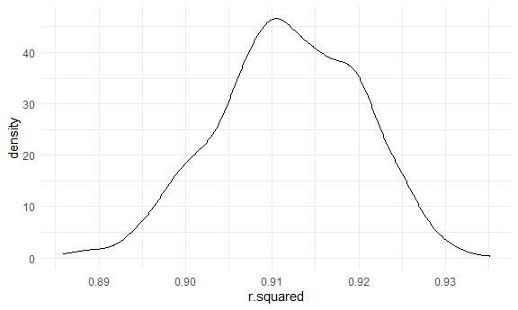
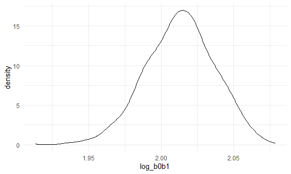

p8105_hw6_jdv2118
================
Justin Vargas

# Loading Libraries and Setting Graphic Settings

``` r
library(tidyverse)
```

    ## ── Attaching packages ─────────────────────────────────────── tidyverse 1.3.2 ──
    ## ✔ ggplot2 3.3.6      ✔ purrr   0.3.4 
    ## ✔ tibble  3.1.8      ✔ dplyr   1.0.10
    ## ✔ tidyr   1.2.1      ✔ stringr 1.4.1 
    ## ✔ readr   2.1.2      ✔ forcats 0.5.2 
    ## ── Conflicts ────────────────────────────────────────── tidyverse_conflicts() ──
    ## ✖ dplyr::filter() masks stats::filter()
    ## ✖ dplyr::lag()    masks stats::lag()

``` r
library(viridis)
```

    ## Loading required package: viridisLite

``` r
library(modelr)

knitr::opts_chunk$set(
  fig.width = 6,
  fig.asp = .6,
  out.width = "90%"
)

theme_set(theme_minimal() + theme(legend.position = "bottom"))

options(
  ggplot2.continuous.colour = "viridis",
  ggplot2.continuous.fill = "viridis"
)

scale_colour_discrete = scale_color_viridis_d

scale_fill_discrete = scale_fill_viridis_d
```

# Problem 1

To obtain a distribution for $\hat{r}^2$, we’ll follow basically the
same procedure we used for regression coefficients: draw bootstrap
samples; the a model to each; extract the value I’m concerned with; and
summarize. Here, we’ll use `modelr::bootstrap` to draw the samples and
`broom::glance` to produce `r.squared` values.

``` r
weather_df = 
  rnoaa::meteo_pull_monitors(
    c("USW00094728"),
    var = c("PRCP", "TMIN", "TMAX"), 
    date_min = "2017-01-01",
    date_max = "2017-12-31") %>%
  mutate(
    name = recode(id, USW00094728 = "CentralPark_NY"),
    tmin = tmin / 10,
    tmax = tmax / 10) %>%
  select(name, id, everything())
```

    ## Registered S3 method overwritten by 'hoardr':
    ##   method           from
    ##   print.cache_info httr

    ## using cached file: C:\Users\Justin\AppData\Local/Cache/R/noaa_ghcnd/USW00094728.dly

    ## date created (size, mb): 2022-09-18 13:28:32 (8.418)

    ## file min/max dates: 1869-01-01 / 2022-09-30

``` r
weather_df %>% 
  modelr::bootstrap(n = 1000) %>% 
  mutate(
    models = map(strap, ~lm(tmax ~ tmin, data = .x) ),
    results = map(models, broom::glance)) %>% 
  select(-strap, -models) %>% 
  unnest(results) %>% 
  ggplot(aes(x = r.squared)) + geom_density()
```



In this example, the $\hat{r}^2$ value is high, and the upper bound at 1
may be a cause for the generally skewed shape of the distribution. If we
wanted to construct a confidence interval for $R^2$, we could take the
2.5% and 97.5% quantiles of the estimates across bootstrap samples.
However, because the shape isn’t symmetric, using the mean +/- 1.96
times the standard error probably wouldn’t work well.

We can produce a distribution for $\log(\beta_0 * \beta1)$ using a
similar approach, with a bit more wrangling before we make our plot.

``` r
weather_df %>% 
  modelr::bootstrap(n = 1000) %>% 
  mutate(
    models = map(strap, ~lm(tmax ~ tmin, data = .x) ),
    results = map(models, broom::tidy)) %>% 
  select(-strap, -models) %>% 
  unnest(results) %>% 
  select(id = `.id`, term, estimate) %>% 
  pivot_wider(
    names_from = term, 
    values_from = estimate) %>% 
  rename(beta0 = `(Intercept)`, beta1 = tmin) %>% 
  mutate(log_b0b1 = log(beta0 * beta1)) %>% 
  ggplot(aes(x = log_b0b1)) + geom_density()
```



As with $r^2$, this distribution is somewhat skewed and has some
outliers.

The point of this is not to say you should always use the bootstrap –
it’s possible to establish “large sample” distributions for strange
parameters / values / summaries in a lot of cases, and those are great
to have. But it is helpful to know that there’s a way to do inference
even in tough cases.

# Problem 2

``` r
homicide_data = 
  read_csv("data/homicide-data.csv") %>% 
  mutate(
    city_state = str_c(city, state, sep = ", "),
    result = case_when(
      disposition == "Closed without arrest" ~ 0,
      disposition == "Closed by arrest"      ~ 1,
      disposition == "Open/No arrest"        ~ 0
      ),
    victim_age = as.numeric(victim_age)
  ) %>% 
  filter(city_state != "Dallas, TX",
         city_state != "Phoenix, AZ",
         city_state != "Kansas City, MO",
         city_state != "Tulsa, AL",
victim_race %in% c("White", "Black"),
victim_sex != "Unknown") %>% 
  select(city_state, result, victim_age, victim_race, victim_sex)
```

    ## Rows: 52179 Columns: 12
    ## ── Column specification ────────────────────────────────────────────────────────
    ## Delimiter: ","
    ## chr (9): uid, victim_last, victim_first, victim_race, victim_age, victim_sex...
    ## dbl (3): reported_date, lat, lon
    ## 
    ## ℹ Use `spec()` to retrieve the full column specification for this data.
    ## ℹ Specify the column types or set `show_col_types = FALSE` to quiet this message.

    ## Warning in mask$eval_all_mutate(quo): NAs introduced by coercion

``` r
baltimore_glm =
  homicide_data %>% 
  filter(city_state == "Baltimore, MD")

glm(result ~ victim_age + victim_sex + victim_race, 
    data = baltimore_glm,
    family = binomial()) %>% 
  broom::tidy() %>% 
  mutate(
    OR = exp(estimate),
    ci_lower = exp(estimate - 1.96 * std.error),
    ci_upper = exp(estimate + 1.96 * std.error)
  ) %>% 
  select(term, OR, starts_with("ci")) %>% 
  knitr::kable(digits = 3)
```

| term             |    OR | ci_lower | ci_upper |
|:-----------------|------:|---------:|---------:|
| (Intercept)      | 1.363 |    0.975 |    1.907 |
| victim_age       | 0.993 |    0.987 |    1.000 |
| victim_sexMale   | 0.426 |    0.325 |    0.558 |
| victim_raceWhite | 2.320 |    1.648 |    3.268 |

``` r
cities_glm = 
  homicide_data %>% 
  nest(data = -city_state) %>% 
  mutate(
    city_models = 
      map(.x = data, ~glm(result ~ victim_age + victim_sex + victim_race, data = .x, family = binomial())),
    result = map(city_models, broom::tidy)
  ) %>% 
  select(city_state, result) %>% 
  unnest(result) %>% 
  mutate(
    OR = exp(estimate),
    ci_lower = exp(estimate - 1.96 * std.error),
    ci_upper = exp(estimate + 1.96 * std.error)
  ) %>% 
  select(city_state, term, OR, starts_with("ci")) %>%
  filter(term == "victim_sexMale")
  
cities_glm
```

    ## # A tibble: 47 × 5
    ##    city_state      term              OR ci_lower ci_upper
    ##    <chr>           <chr>          <dbl>    <dbl>    <dbl>
    ##  1 Albuquerque, NM victim_sexMale 1.77     0.831    3.76 
    ##  2 Atlanta, GA     victim_sexMale 1.00     0.684    1.46 
    ##  3 Baltimore, MD   victim_sexMale 0.426    0.325    0.558
    ##  4 Baton Rouge, LA victim_sexMale 0.381    0.209    0.695
    ##  5 Birmingham, AL  victim_sexMale 0.870    0.574    1.32 
    ##  6 Boston, MA      victim_sexMale 0.667    0.354    1.26 
    ##  7 Buffalo, NY     victim_sexMale 0.521    0.290    0.935
    ##  8 Charlotte, NC   victim_sexMale 0.884    0.557    1.40 
    ##  9 Chicago, IL     victim_sexMale 0.410    0.336    0.501
    ## 10 Cincinnati, OH  victim_sexMale 0.400    0.236    0.677
    ## # … with 37 more rows

``` r
cities_plot =
  cities_glm %>% 
  mutate(city_state = fct_reorder(city_state, OR)) %>% 
  ggplot(aes(x = city_state, y = OR)) + 
  geom_point() + 
  geom_errorbar(aes(ymin = ci_lower, ymax = ci_upper)) + 
  labs(
    x = "City and State Names",
    y = "Odds Ratio",
    title = "The Odds Ratio for Each City and State"
  ) + 
  theme(axis.text.x = element_text(angle = 90, hjust = 1))

cities_plot
```


